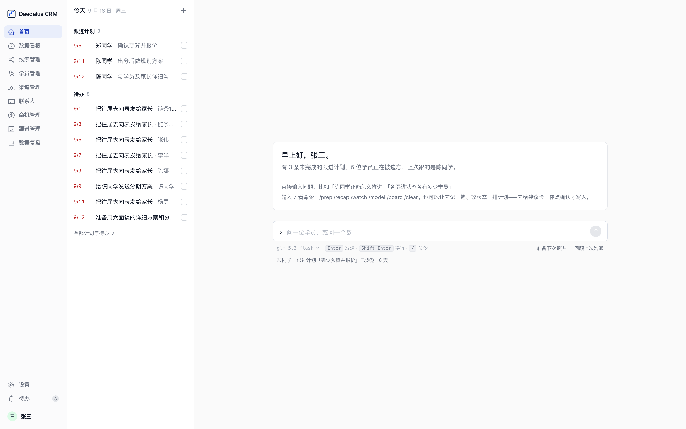
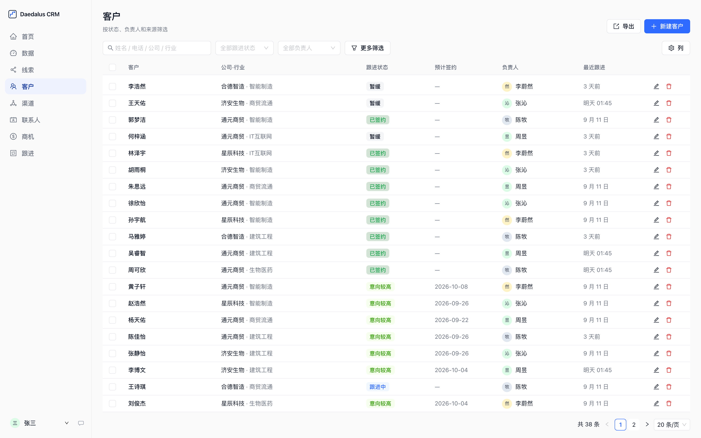
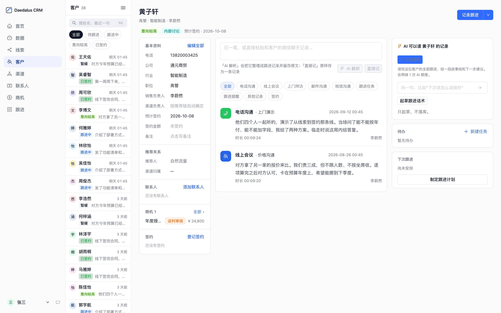

# Daedalus CRM

给 1–20 人的教培 / 升学咨询团队用的客户管理系统：线索、学员、跟进、商机、推荐归属，
外加五个**只起草、不落库**的 AI 功能。自己部署，数据放在自己手里，一份 SQLite 文件就是全部。

不是教培也能用：客户叫什么、档案字段叫什么、下拉里有什么选项，都在设置页里改，不用碰代码。



| 学员列表 | 学员详情 |
|---|---|
|  |  |

## 三种跑法

**本地开发**（Node 22+）

```bash
npm install
npm run setup     # 生成 Prisma Client、建表、灌入演示账号
npm run dev
```

打开 http://localhost:3000，`admin` / `crm@2026`。

**Docker 单机**（推荐给团队用）

```bash
cp .env.example .env     # 至少填 AUTH_SECRET 与 INIT_PASSWORD
docker compose up -d --build
```

打开 http://服务器IP:3000，`admin` / 你设的 `INIT_PASSWORD`。没有默认密码，不给 `INIT_PASSWORD` 会拒绝启动。

**Docker + HTTPS**：`.env` 里加 `DOMAIN=你的域名` 和 `COOKIE_SECURE=true`，然后

```bash
docker compose -f docker-compose.yml -f docker-compose.caddy.yml up -d --build
```

Caddy 自动签证书。升级、备份、恢复、回滚见 [DEPLOY.md](DEPLOY.md)。

## 有什么

**线索 → 学员 → 跟进 → 商机 → 签约**这条主链，加上小团队真正会踩的坑：

- **推荐归属**：推荐人、渠道归属（推荐链往上第二代）、渠道负责人三者独立记录，录入时固化，改上游不追溯改业绩
- **并发保护**：两人同时改一条学员，不同字段自动合并，同一字段才拦；同时转化同一条线索只建一条
- **操作留痕**：所有人可见可改全部数据，每次写操作记日志，只增不删
- **查重**：手机号失焦即预警并说清撞的是谁；同一天同金额的签约要二次确认
- **CSV 导出**带 BOM、按 RFC 4180 转义、挡公式注入
- **登录限流**（按 IP 与账号），XSS 按字面显示

**五个 AI 功能**，全部遵守同一条原则：AI 只起草，人核对后走原有的保存流程；没配 key 时入口整体隐藏，其余照常。

| 功能 | 在哪 | 做什么 |
|---|---|---|
| 跟进速记 | 新建跟进弹窗 | 口述或直接粘贴微信聊天记录，AI 预填类型、要点、下次计划、待办 |
| 临战简报 | 学员详情 | 联系前一键生成：故事线、卡在哪、建议谈什么、风险 |
| 问数据 | 数据复盘 | 自然语言问业务数字。AI 只把问题翻译成受限的查询规格，不写 SQL |
| 盯盘提醒 | 数据首页 | 被遗忘的学员 / 停滞的商机 / 逾期的计划——检测是纯规则，AI 只在点「起草跟进」时写话术 |
| 转介绍雷达 | 渠道管理 | 谁在帮你带人、下一个该请谁开口——排序是纯规则，AI 按需起草邀请 |

## 配 AI

管理员登录 → **设置管理 → AI 接入**，填三项：接口地址、API Key、模型名，点「测试连接」看到耗时和模型回复，再保存。
任何 OpenAI 兼容接口都行：

| | 接口地址 | 模型名示例 |
|---|---|---|
| DeepSeek 官方 | `https://api.deepseek.com/v1` | `deepseek-chat` |
| OpenAI | `https://api.openai.com/v1` | `gpt-4o-mini` |
| 本地 Ollama | `http://localhost:11434/v1` | `qwen2.5`（Key 随便填） |
| 各类中转站 | 它给你的地址 | 它支持的模型名 |

Key 用 `AUTH_SECRET` 派生的密钥加密后存库，界面只回显尾 4 位，数据库备份里不会出现明文。
也可以用环境变量 `LLM_API_KEY / LLM_BASE_URL / LLM_MODEL` 配，界面配置优先。

两条踩过的坑：推理模型的 `max_tokens` 会先被思维链吃掉，给小了正文为空——代码里默认给了 4000；
部分网关不支持 `response_format=json_object`，会自动降级为普通调用再解析。

## 不是教培？改术语

**设置管理 → 业务配置**：

- **业务简介**：一段话说你们卖什么、客户是谁、怎么成交。它进所有 AI 提示词，改这一段，五个 AI 功能一起换语境
- **客户叫什么**：默认「学员」，工作室改「客户」——侧边栏、表头、表单、提示、AI 提示词全站同步
- **三个档案字段名**：默认「院校 / 年级 / 专业」，改成「公司 / 类型 / 行业」之类；数据库列不动
- **三组选项列表**：年级、线索来源、行业，纯数据，随便改

**不能改的**：跟进状态与决策状态的取值（「已试听」「与家人商议」「已决定报名」）。它们被盯盘权重、雷达、首页统计、终态判断按值引用。可改显示名在[路线图](ROADMAP.md)上。

## 数据归你

一个实例一个团队，数据是 Docker 卷里的一份 SQLite（WAL 模式，几人到二十人并发够用）。
备份用 `VACUUM INTO` 拿一致性快照，**不要直接复制 `crm.db`**——细节与恢复步骤见 [DEPLOY.md](DEPLOY.md)。
迁移只增不改不删，旧版本镜像能跑在新库上，回滚不用动数据。

## 安全须知

`AUTH_SECRET` 要随机且够长；首次启动必须给 `INIT_PASSWORD`；只经 HTTPS 访问时 `COOKIE_SECURE=true`；
AI 功能会把客户姓名与跟进记录发给你配置的模型接口，用第三方接口前确认其数据政策。
详见 [SECURITY.md](SECURITY.md)。

## 技术栈

Next.js 16（App Router + Server Actions）· Ant Design 6 · ECharts 6 · Prisma + SQLite · JWT（jose）+ bcrypt。
测试：Vitest 230 条（含直接调 Server Action 的并发用例）+ Playwright 57 条 E2E；
`tsc + eslint + vitest` 走 git 钩子与 CI，E2E 在 CI 单独跑。开发细节见 [CONTRIBUTING.md](CONTRIBUTING.md)。

## 路线图与许可证

[ROADMAP.md](ROADMAP.md)。AGPL-3.0：自托管随便用、随便改；改了并对外提供服务，要公开改动。
