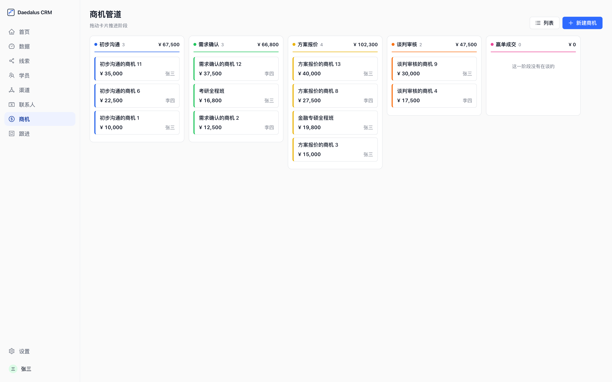
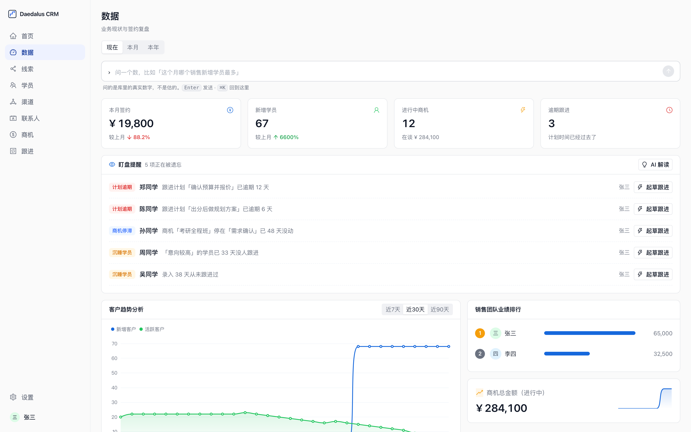

<div align="center">


# Daedalus CRM

**The next-generation CRM that runs on your own machine. AI drafts, you decide.**

A CRM for teams of 1–20: leads → customers → follow-ups → deals → contracts, with referral attribution computed for you.<br/>
The home page is an agent: ask a question and it decides what to look up; ask it to change data and it hands you a proposal card — nothing is written until you confirm.

[](LICENSE)
[](https://github.com/BeckY824/daedalus-crm/actions/workflows/ci.yml)
[](https://github.com/BeckY824/daedalus-crm/tags)
[](https://github.com/BeckY824/daedalus-crm/pkgs/container/daedalus-crm)
[](https://github.com/BeckY824/daedalus-crm/stargazers)

[简体中文](README.md) · **English**

[Website](https://ai-daedalus.com) · [Download the desktop app](https://ai-daedalus.com/download.html) · [Deployment](docs/部署.md) · [Roadmap](ROADMAP.md) · [Issues](https://github.com/BeckY824/daedalus-crm/issues)

</div>

<br/>

## Two editions — take the one that fits

**The desktop app is the one we lead with.** It is built for one person: install it and it runs, your data is a single file on your machine, no server needed.

| | Who | How to get it | Version |
|---|---|---|---|
| 🖥 **Desktop app** (primary) | **One person.** A salesperson, a freelancer, a one-person company | [Download the .dmg](https://ai-daedalus.com/download.html) (macOS, Apple silicon); in-app "Check for updates" is delta-based | See the Assets on the [latest Release](https://github.com/BeckY824/daedalus-crm/releases/latest) |
| 👥 **Team edition** | **A team.** Several people on one shared database | Self-host: `docker compose up -d` (see [docs/部署.md](docs/部署.md))<br/>or use the instance we host — [tell us](https://ai-daedalus.com/demo.html) | Image `ghcr.io/becky824/daedalus-crm:<version>` |

**Same codebase and same version number, but they can ship on different days**: after a desktop release the instance we host may still be on the previous version — [app.ai-daedalus.com/api/health](https://app.ai-daedalus.com/api/health) is the source of truth.

<br/>

<div align="center">

**100% open source &nbsp;·&nbsp; Self-hosted, data never leaves your network &nbsp;·&nbsp; AI only drafts — every write is a human click**

</div>

- ✅ One command: `docker compose up -d`. Zero config, no credit card
- ✅ The home page is an agent: ask about a customer or a number and it decides what to search, read and query — every step visible
- ✅ Tell it "log a call", "mark as signed", "schedule next Wednesday", "create a deal" — it returns an editable proposal card; nothing lands until you confirm
- ✅ Paste a chat transcript on a record page; AI turns it into a follow-up, tasks and next steps, with the original kept
- ✅ Referral attribution: who introduced whom and whose performance it counts toward, frozen at entry — upstream edits never rewrite history
- ✅ Phone dedup, double-confirm on repeated contract amounts, field-level merge on concurrent edits, full audit trail
- ✅ Runs on DeepSeek: pick it in Settings, paste a key, done — endpoint and model name are filled in for you (any other OpenAI-compatible endpoint still works under "Other")
- ✅ AI never acts on its own: every model call is a click you make — opening a page never triggers one (free credits are counted per call; the UI shouldn't spend them for you)
- ✅ Two columns, not three: navigation on the left is always there, content on the right. Only the customer record page adds a narrow list — for when you flip through people one after another
- ✅ Keyboard-first where it matters: ⌘K to jump or ask, ⌘, for settings, ⌘1–9 for modules
- ✅ Generic sales wording out of the box (customer / company / title / industry); education-sales wording is one preset click away

<br/>


<br/>

## 🚀 Getting started

### Docker (recommended)

```bash
git clone https://github.com/BeckY824/daedalus-crm.git && cd daedalus-crm
docker compose up -d
```

### Or run locally (Node 22+)

```bash
git clone https://github.com/BeckY824/daedalus-crm.git && cd daedalus-crm
npm install && npm run setup && npm run dev
```

Open **http://localhost:3000** and sign in with a demo account:

| Username | Password | Role |
|---|---|---|
| `admin` | `admin123` | Administrator |
| `zhangsan` | `admin123` | Sales (demo) |
| `lisi` | `admin123` | Sales (demo) |

Change the password under the account menu (bottom-left) → Settings → Sign-in & password. That's it.

- **Enable AI**: Settings → AI (the account menu at the bottom left, or press ⌘,), enter the endpoint, API key and model, hit "Test connection". Without it the AI entry points simply don't appear; everything else works
- **Different industry?** Settings → Business config renames the noun and the three profile fields site-wide (education admissions is a ready-made preset — one click swaps the whole set)
- **HTTPS, upgrades, backups**: see [docs/部署.md](docs/部署.md)

### The team edition

**One person? Install the desktop app** (primary — see the next section): it runs as soon as you install it, your data stays on your machine, no server needed.

For a team sharing one database there are two routes: `docker compose up -d` on your own box, or the [team edition we host](https://app.ai-daedalus.com) — nothing to install or configure, one set of credentials for the team, everyone in the same workspace. [Tell us](https://ai-daedalus.com/demo.html) or email qy1g18@gmail.com. Same codebase either way.

[app.ai-daedalus.com/signup](https://app.ai-daedalus.com/signup) creates a **cloud account** for the desktop app (it tracks AI credits); it does not create a web workspace. For your own data, install the desktop app or self-host.

### Desktop apps

The Mac build (Apple silicon) **ships the whole server inside the app**: install it and it runs, your data is a single file on your machine, no server needed.
The first launch opens a sign-in window — **sign up with an email, it's free** (the window links out to sign-up and can reset your password). The account only tracks AI credits; your data is never uploaded.

Two ways to get AI: use the account's free credits (30 on sign-up, 3 more each day you use it), or put your own model API key in **Settings → AI**, which bypasses our allowance entirely — the key is encrypted on your machine and only ever sent to the endpoint you typed. The settings page tells you which of the two is in use and how many calls are left.

To share one database across a team, switch the menu to "Connect to a server" and point it at your own deployment. There are no Windows or Intel Mac builds yet; on those machines use the self-hosted version for now.

Builds are produced by [GitHub Actions](https://github.com/BeckY824/daedalus-crm/actions/workflows/desktop.yml) on every tag. Install, Gatekeeper and updates: [docs/桌面端安装.md](docs/桌面端安装.md).

<br/>

## ✨ Key features

### Navigation always there, everything else serves the task

A 220px rail on the left, with the eight module names spelled out — no hovering to find out what an icon means. **The middle column is not a default slot**: it shows up only when you flip between records of the same kind, which today means exactly one place — the narrow list on the customer record page. A module with two views (deals: pipeline / list; follow-ups: plan / log) switches from a header button instead of spending a column on it. The rail's right edge can be dragged to resize, and that width is remembered on this machine. Settings is not a page but a **layer** over whatever you were looking at — Esc closes it and you're back. On desktop the system title bar is removed and the window buttons sit at the top of the rail.

Things you press shrink a little and spring back, pages fade in, dialogs are centered — and with the system's "Reduce motion" on, nothing moves at all.

### The home page is an agent, not a search box

Interaction modeled on Claude Code / Codex: Enter to send, follow-ups queue while it's answering, Esc to interrupt. Underneath is a ReAct loop where the model picks read-only tools — search customers, read a record, query a metric, check the watchlist — each call shown as a line, collapsed to a one-line summary when done. Answers stream token by token with citation chips that jump back to the source record. Multi-turn context is kept, so "what about him?" just works.

### AI proposes, you decide

Ask it to change a status or profile field, log a follow-up, schedule a plan, create a lead / deal / contract, or edit a channel — it returns a **proposal card**. Fields are editable in place; unknown ones are left blank for you. Confirming runs the exact same server actions the UI uses: dedup, cycle checks, attribution recompute and audit logging are never bypassed. Every confirmation is logged as `ai_apply`.

### Record page: profile, timeline, AI on request

Profile on the left, editable with a click; a single timeline in the middle; a quick-note box on top where you paste a chat and AI drafts the follow-up, tasks and next plan for you to review — the original text is kept for later briefings. The AI column on the right **does not call the model when the page opens**: press "Generate briefing" and it reads this person's entire history, with the credit cost written next to the button. Deleting one follow-up doesn't open a dialog either — the delete button turns into "Delete this? Delete / Cancel" in place.

### Bring in the list you already have

An "Import" button on the customer list, two ways in: **drop an Excel / CSV file**, or **paste a block of text** — a message forwarded from WeChat, a group sign-up, a list of names from meeting notes — and AI slices it into a table. From step two on, both paths are identical: map columns, review, preview, run, each step telling you what happens next.

- **Files are never uploaded**: parsed in your browser, written straight to your own database. The paste path sends the text only to the model you configured
- **Identity is the phone number**: same number, same person. Rows already in the database can only be "skipped" or "fill blanks only" — **there is no overwrite**; a spreadsheet must never wipe what a person typed
- **Columns it can't match, it reads again**: for the columns the synonym table misses, the **header plus the first three rows of values** (and nothing else) go to the model for a second pass. What comes back is only the pre-selection in those dropdowns — **you still confirm it in the review step** — and when it isn't sure it leaves the column unmapped rather than forcing a guess. It costs none of your free AI credits, and Settings → AI → auto-detect turns it off, falling back to the synonym table
- **One unreadable cell doesn't block the row**: it's left blank and flagged, the rest goes in. Columns we don't have (WeChat ID, tier) are folded into the notes field rather than silently dropped
- **Job title / grade takes whatever your sheet says**: the dropdown is only a **suggestion** — a value that isn't on it goes in **verbatim**, flagged "imported as-is" in the review step. The same field in the new-customer form and on the record page is **pick-or-type**. Follow-up status and decision status are deliberately not opened up: the watchlist, the suggestion cards and the report groupings all key off those categories, so a word only its author understands would drop that record out of the numbers
- **AI only slices, never infers**: every cell must be verbatim from the source. Invented cells are cleared and listed; phone numbers present in the text but missing from the table are listed too
- **Every batch can be undone**, even later, from Settings → Imports

### Referral attribution with one clear rule

Channel → customer → referred customer: attribution goes two generations up, or to the top of the chain if shorter; the channel owner is inherited along the whole chain. Attribution is frozen at entry — **changing an upstream referrer or a channel's owner never rewrites existing customers' performance**. Individual mistakes are corrected on that one record.

### The team-edition backbone (optional)

Same codebase; `MULTI_TENANT=1` turns on multi-tenancy: one SQLite file per workspace (physical isolation), email sign-up with a verification code, self-service password reset, subscriptions and an ops console, a free-AI-credits ledger (30 on sign-up, 3 per active day). We run it for the team edition (the workspace we hand to teams) and the desktop app's cloud accounts. Self-hosted and desktop installs never execute a line of it.

### Runs on DeepSeek, or bring your own endpoint

The one-click list has only DeepSeek on it — **the prompts are tuned to one model's quirks**. The same paragraph misbehaves differently elsewhere: one model answers "there aren't any" without looking, another wraps a single phone number in a six-column table. Offering a row of choices is inviting people down paths we never verified, and when it breaks they blame the product.

To point somewhere else, "Other (enter your own endpoint)" in Settings takes an address, key and model name and works fine — we just haven't verified each one. Settings can also hold a model list (or pull it from the endpoint) and you switch right under the input box — each user picks their own. Reasoning models' "always thinking" quirks and token-budget issues are handled automatically.

<br/>

## 🧩 Use cases

| Scenario | How |
|---|---|
| **Any small sales team** | The default wording: customers, companies, titles, industries; the lead → customer → deal pipeline is generic |
| **Education / study-abroad admissions** | One click on the "education admissions" preset in Settings → Business config: students, schools, grades, majors, referral attribution |
| **One person** | The desktop app (primary): install and go, data on your machine, no server |
| **Self-hosted, sensitive data** | One container, one SQLite file — backup is a file copy; AI is read-only |
| **No deployment wanted** | Desktop app: install and go, data stays on your machine; or use the web version we host — ask us for credentials |

<br/>

## 🖼️ Screens

| Customers | Record page |
|---|---|
|  |  |

| Deal pipeline | Dashboard |
|---|---|
|  |  |

More in [docs/shots](docs/shots).

<br/>

## 🛠️ Tech stack

| Layer | Choice |
|---|---|
| Framework | Next.js 16 · React 19 · TypeScript 5 |
| Data | Prisma 6 · SQLite (one file per install; one per workspace in the team edition) |
| UI | Ant Design 6 · motion |
| AI | OpenAI-compatible API, ReAct loop, read-only tools; one-click DeepSeek, or bring your own endpoint |
| Tests | vitest (1136 unit) · Playwright (117 self-hosted + 13 team-edition e2e) · green CI required to merge |
| Delivery | Multi-arch Docker image (GHCR) · Electron desktop (macOS, Apple silicon) · Caddy auto-HTTPS |

<br/>

## 🗺️ Roadmap

Ordered by "someone actually needs it". To push an item, [open an issue](https://github.com/BeckY824/daedalus-crm/issues) with your scenario. Full version in [ROADMAP.md](ROADMAP.md).

| Area | Scope | Status |
|---|---|---|
| Conversation & proposal cards | agent loop, streaming, citations, multi-turn context, 7 card types | ✅ Shipped |
| Record page | inline profile editing, timeline, quick-note parsing, on-request briefing | ✅ Shipped |
| Shell & feel | resizable rail, settings as an overlay, ⌘K / ⌘, / ⌘1–9, press feedback everywhere | ✅ Shipped |
| Team-edition backbone | multi-tenant, sign-up and free credits, ops console, cloud accounts for the desktop app | ✅ Shipped |
| List pages | inline editing without opening the record | 🔜 Planned |
| Saved views | keep a set of filters and come back to it in one click | 🔜 Planned |
| Online payments | WeChat / Alipay (requires ICP filing & merchant account) | ⏸ On demand |

<br/>

## 🤝 Contributing

Issues and PRs welcome. Development, testing and commit conventions are in [CONTRIBUTING.md](CONTRIBUTING.md); conventions for AI coding assistants in [AGENTS.md](AGENTS.md).

<a href="https://github.com/BeckY824/daedalus-crm/graphs/contributors">
  
</a>

<br/>

## 🔒 Security

Please report vulnerabilities privately as described in [SECURITY.md](SECURITY.md) rather than opening a public issue.

<br/>

## 📄 License

[AGPL-3.0](LICENSE): use and modify freely when self-hosting; if you modify it and offer it as a service, publish your changes.

<br/>

## 🌐 Community & contact

- Website: [ai-daedalus.com](https://ai-daedalus.com)
- Desktop app: [ai-daedalus.com/download.html](https://ai-daedalus.com/download.html) · the team edition: ask us
- Questions & ideas: [GitHub Issues](https://github.com/BeckY824/daedalus-crm/issues)
- Want the web version, or just to talk: [tell us](https://ai-daedalus.com/demo.html) · qy1g18@gmail.com

<br/>

## ⭐ Star History

<a href="https://star-history.com/#BeckY824/daedalus-crm&Date">
  
</a>
